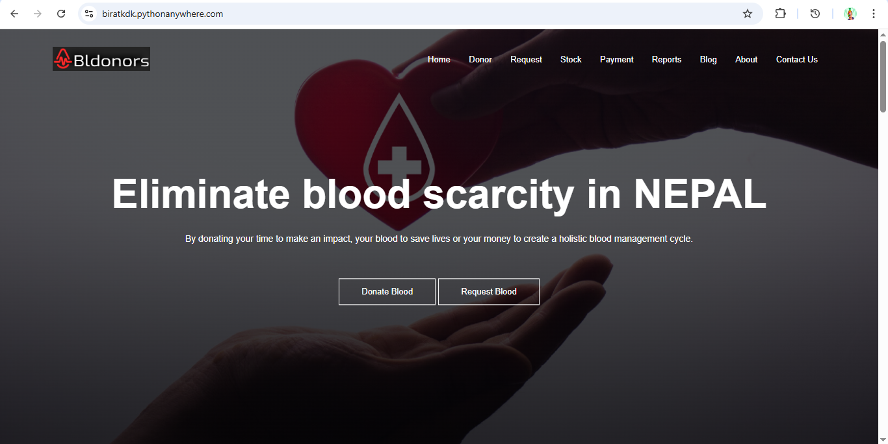
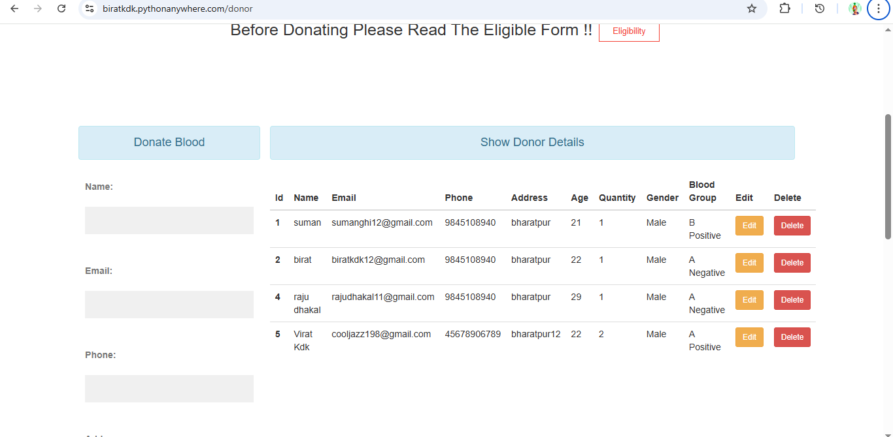
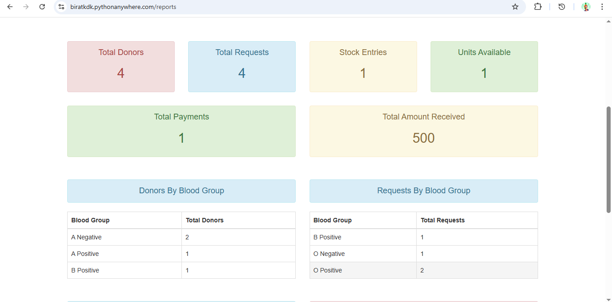
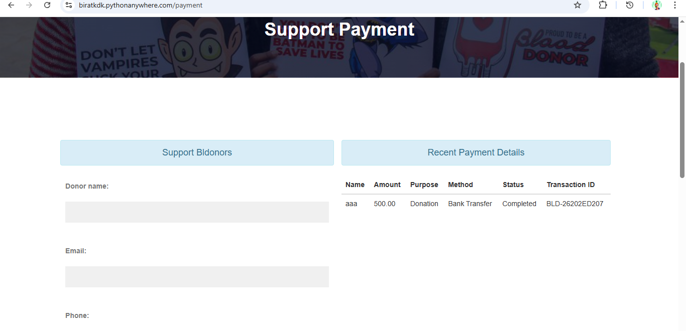
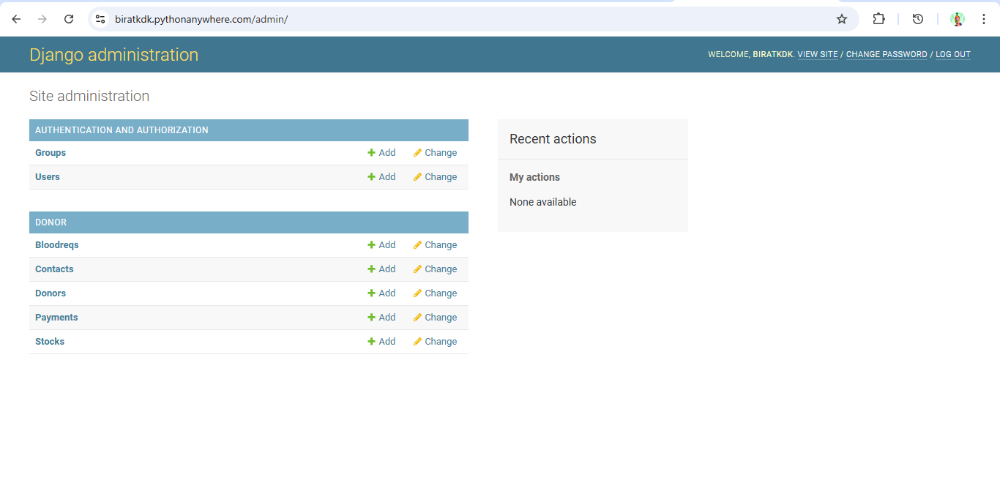

# Blood Donor Management System

A Django-based web application for managing blood donors, blood requests, blood stock, and support payments.

## Live Demo

- Demo: `https://biratkdk.pythonanywhere.com`

## About The Project

This project was developed as a blood bank management system using Django. The main goal of the project is to keep donor records, manage blood requests, track stock, and provide some basic administrative features in a single system.

It was originally built as an undergraduate academic project and was later cleaned up, documented, and extended with a few additional features for presentation and deployment.

## Project History

- Initial system design and core implementation: 2020 to 2021
- Maintenance, cleanup, and feature expansion work: later follow-up updates
- Current repository state: documentation, tests, deployment notes, and portfolio-friendly cleanup

## Features

- Donor registration and listing
- Blood request submission and tracking
- Blood stock management
- User registration, login, and logout
- JSON API for donors, blood requests, stock, and session status
- Email notifications for blood requests, low stock alerts, and payment receipts
- Reports dashboard with summary metrics and CSV export
- Lightweight realtime dashboard updates using AJAX polling
- Support payment recording with transaction IDs
- Django admin support for core records

## Tech Stack

- Python 3.9
- Django 3.2.5
- SQLite
- HTML, CSS, Bootstrap, jQuery
- PythonAnywhere for deployment
- GitHub Actions for automated tests

## Project Structure

```text
bldonors/
|-- bldonors/            # Django project settings and URLs
|-- donor/               # Main application: models, views, forms, API, tests
|-- templates/           # HTML templates
|-- static/              # CSS, JS, images, favicon assets
|-- requirements.txt
|-- Procfile
|-- runtime.txt
```

## Main Modules

### Donor Management

Stores donor details such as blood group, contact number, address, age, and donation quantity.

### Blood Request Management

Allows users to request blood and keeps request details in the system.

### Stock Management

Tracks available blood units and shows low stock cases.

### Reports Dashboard

Shows summary values and grouped report data, with CSV export support.

### API Layer

Available JSON endpoints:

- `/api/summary/`
- `/api/donors/`
- `/api/blood-requests/`
- `/api/stocks/`
- `/api/session/`

More details are available in `API_GUIDE.md`.

### Notifications

Sends email notifications for:

- new blood requests
- low stock alerts
- payment receipts

See `NOTIFICATIONS.md` for details.

### Payments

Supports recording support or donation payments with purpose, amount, method, status, and generated transaction ID.

See `PAYMENTS.md` for details.

## Screenshots

Add screenshots in the `screenshots/` folder.

### Home Page



Main landing page of the system.

### Donor Management



Donor listing page.

### Reports Dashboard



Reports dashboard page.

### Payment Module



Payment form page.

### Admin Panel



Admin panel page.

## Local Setup

1. Create and activate a virtual environment.
2. Install dependencies:

```bash
pip install -r requirements.txt
```

3. Run migrations:

```bash
python manage.py migrate
```

4. Start the development server:

```bash
python manage.py runserver
```

5. Open `http://127.0.0.1:8000/`

The local SQLite database file is intentionally not version-controlled.

## Settings

Production-ready settings are split into:

- `bldonors/settings.py`
- `bldonors/settings_dev.py`
- `bldonors/settings_prod.py`

Use `.env.example` for reference.

## Extra Notes

Project notes are available in:

- `API_GUIDE.md`
- `NOTIFICATIONS.md`
- `REPORTS.md`
- `REALTIME.md`
- `PAYMENTS.md`
- `DEPLOYMENT.md`
- `UPGRADE_ROADMAP.md`

## Testing

Run the test suite with:

```bash
python manage.py test
```

The project includes baseline tests for views, authentication, reports, payments, and API behavior.

GitHub Actions is configured to run the test suite automatically on pushes and pull requests.

## Deployment

The project is prepared for simple student-friendly deployment on PythonAnywhere.

Deployment-related files:

- `DEPLOYMENT.md`
- `Procfile`
- `runtime.txt`
- `requirements.txt`

## Future Improvements

- role-based access control
- stronger validation and workflow rules
- verified payment gateway integration
- SMS notifications
- improved charts and analytics
- PostgreSQL-based production database

## License

This project is available under the MIT License. See `LICENSE`.

## Author

- Birat Khadka
